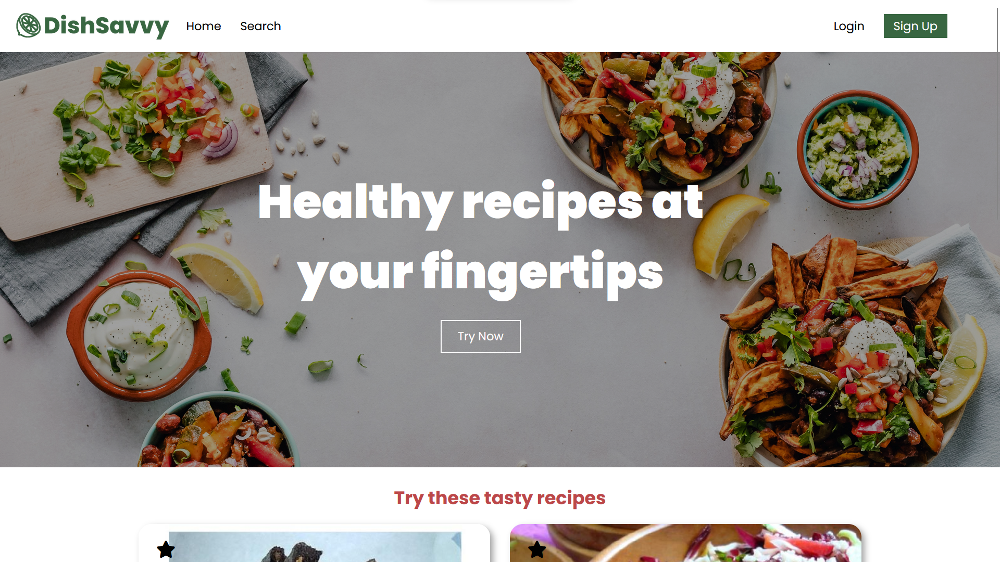

# DishSavvy 
DishSavvy is a web application that allows users to easily search for recipes that align with their dietary needs. Users can
view recipes and create an account to save recipes for later. This project was originally made for the Smart Cities 2023 hackathon. 
It was built using the [Spoonacular API](https://spoonacular.com/food-api/docs).

## Contributors
* @Piyush-Bhor - Piyush Bhor
* @ChrisPag - Christina Bose Paguirigan

## Technologies Used
* HTML
* CSS
* JavaScript
* EJS
* Node.js
* Express
* MongoDB

## Improvements
This project is a work in progress. We would still like to add some features, and there are a few bugs that need to be fixed. Some features we would like to include are OAuth, and the ability to search for recipes using ingredients. In addition, the button to add a recipe to favourites should change colours when the user clicks on it.

## Usage
1. Clone this repo locally
2. Navigate to the top level of the directory
3. Run `npm install` in your command line to install dependencies
4. Run `node index.js` in your command line to run the app
